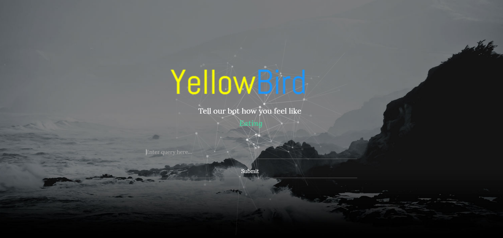

## Inspiration
Having a look into the proposed challenges,  we found the one from _Yellow Pages_  very catchy. However, we had already the idea of working with _Nuance_ and their text processing API, so we decided to combine both in this project.

## What it does
There are two parts of this project.

###Tweeter bot
Takes a tweet mentioning our [bot](https://twitter.com/butterxxxx) with the hashtag '#askYP', and returns a couple of relevant results plus a link to [Yellow Pages](www.yellowpages.ca).

###Web app
Takes a query form a search bar and displays a map with the relevant results.

## How we built it
We first created a python app that managed the API requests independently and then integrated both of them as an interface (input: query; output: JSON with the relevant merchants).
Later, the team divided in two groups. Nawras leaded the Web App interface and Dani leaded the Twitter bot interface. Working together, the core app evolved to serve both ends and the grammar used for the _Nuance_ API grew in size to evaluate more variate results.

## Challenges we ran into
- Incompatibilities between the different frameworks used leaded to a full rebuild of the code after 6 hours of work, which implied a significant delay in our project.
- Filtering the extended results from _Yellow Pages_'s API was also something to deal with.
- _Nuance_'s API went through some reliability issues that prevented us from testing at some intervals of time.

## Accomplishments that we're proud of
Putting together the two APIs working in both the Twitter Bot and the Web App was very rewarding.

## What we learned
We have learnt how to integrate 4 different APIs (including Google Maps and Twitter) in our project, utilizing a powerful full stack framework as Django.

## What's next for YellowBird
Further extensions would be the deployment of the website in a server that allowed us to embeed the link to our Web App in the tweet, integrating both interfaces
